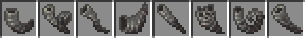

# Custom Goat Horns Minecraft Resourcepack
This work is licensed under CC0, please see LICENCE.txt for more information.\
This resourcepack changes the minecraft goat horns to have unique textures for each of their sounds.\
I also attempted to match the horn shape with the sound\
This pack requires the [CIT Resewn mod](https://www.curseforge.com/minecraft/mc-mods/cit-resewn) for Fabric.
If you wish to use this pack with Optifine instead, you must rename the `assets/minecraft/citresewn` folder to `assets/minecraft/optifine`, but keep in mind I don't support Optifine, so use it at your own risk!
Enjoy!

## Screenshots

From left to right: Ponder, Sing, Seek, Feel, Admire, Call, Yearn, Dream\

